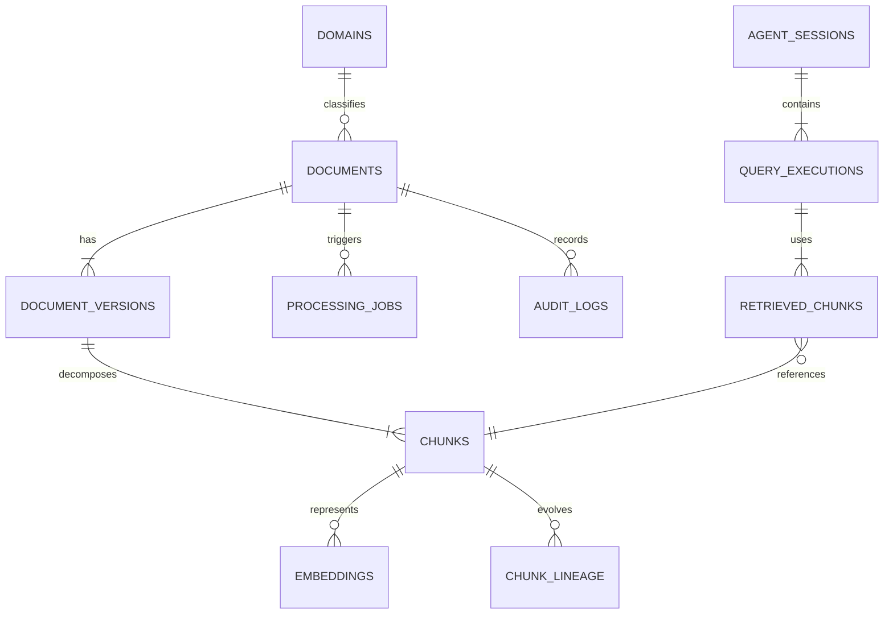

# Documento ERD

## Primero una regla

- No diseñaremos el ERD pensando en “guardar documentos”.

- Diseñaremos el ERD pensando en responder esta pregunta:

    "Can the system understand what changed, what knowledge was derived,

    what must be reprocessed, and what answer was generated?"

Porque el sistema no almacena archivos, administra conocimiento derivado de documentos versionados.

## Principio arquitectónico

El sistema tiene 4 dominios separados.

1. Document Management
2. Knowledge Processing
3. Retrieval Layer
4. Agent Interaction Layer

Si mezclamos estos dominios, después aparece deuda técnica.

Vista conceptual primero

```text
Document
    |
    |
    +------ DocumentVersion
                    |
                    |
                    +------ Chunk
                               |
                               |
                               +------ Embedding
                               |
                               +------ ChunkLineage

Document
    |
    +------ ProcessingJob

Document
    |
    +------ AuditLog

Document
    |
    +------ Domain

AgentSession
    |
    +------ QueryExecution
                    |
                    |
                    +------ RetrievedChunk

```

Ese sería el mapa macro.

### DOMINIO 1 — Document Management

"documents": Representa identidad permanente, nunca cambia.

Ejemplo: employee_policy.pdf

**_Campos_**

- document_id PK
- filename
- original_path
- mime_type
- size_bytes
- binary_hash
- current_version
- processing_strategy
- domain_id FK
- manifesto JSONB
- created_at
- updated_at
- deleted_at

**_Relaciones_**

1 document has many versions

documents

1 ------ N document_versions

"document_versions": Cada modificación crea una versión.

Ejemplo.

v1
v2
v3

**_Campos_**

- version_id PK
- document_id FK
- version_number
- content_hash
- change_summary JSONB
- created_at

**_Relación_**

document_versions

1 ------ N chunks

### DOMINIO 2 — Knowledge Processing

Aquí vive el conocimiento derivado.

"chunks": Fragmentos textuales.

_**Campos**_

- chunk_id PK
- version_id FK
- chunk_index
- parent_section
- chunk_hash
- content
- context_header
- token_count
- is_active
- created_at

**_Relación_**

chunks

1 ------ N embeddings

"embeddings": Representación vectorial.

Separada.

- Nunca mezclar con chunk.

**_Campos_**

- embedding_id PK
- chunk_id FK
- embedding_model
- dimension
- vector VECTOR(1536)
- is_active
- created_at

Ejemplo.

Mismo chunk.

OpenAI embedding

BGE embedding

Gemma embedding

Tres embeddings distintos.

chunk_lineage

La tabla más importante para procesamiento incremental.

Permite comparar versiones.

Ejemplo.

Documento v1.

chunk_14

Documento v2.

chunk_55

Relación.

chunk_14 → chunk_55

Campos.

lineage_id PK

old_chunk_id FK

new_chunk_id FK

change_type

created_at

change_type.

UNCHANGED

UPDATED

CREATED

DELETED
DOMINIO 3 — Processing Layer

Controla ejecución.

processing_jobs

Cada operación genera job.

Ejemplo.

embedding generation

Campos.

job_id PK

document_id FK

stage

status

duration_ms

worker

error_message

details JSONB

created_at

stage.

HASHING

EXTRACTION

NORMALIZATION

CHUNKING

EMBEDDING

INDEXING

status.

PENDING

RUNNING

SUCCESS

FAILED

RETRY
DOMINIO 4 — Classification Layer
domains

Clasificación semántica.

Campos.

domain_id PK

name

confidence

description

Ejemplo.

finance

engineering

legal

medicine

Relación.

domains

1 ------ N

documents
Auditoría
audit_logs

Todo evento relevante.

Campos.

audit_id PK

document_id FK

operation

actor

result

details JSONB

created_at

Ejemplo.

document uploaded

user id 123
Agent Layer

Todavía no implementamos.

Pero debemos prepararlo.

agent_sessions

Una conversación.

Campos.

session_id PK

started_at

ended_at

user_identifier

session_context JSONB

Relación.

agent_sessions

1 ------ N

query_executions
query_executions

Cada pregunta.

Campos.

query_id PK

session_id FK

user_query

retrieval_strategy

llm_provider

latency_ms

confidence_score

created_at

Ejemplo.

Pregunta.

What was the best selling product in 2015?
retrieved_chunks

Qué chunks usó el sistema.

Muy importante.

Campos.

retrieval_id PK

query_id FK

chunk_id FK

relevance_score

Ejemplo.

La respuesta usó:

chunk 18

chunk 42

chunk 91

Debe quedar trazabilidad.

ERD textual

Versión compacta.

```texto
domains
   |
   | 1:N
   |
documents
   |
   | 1:N
   |
document_versions
   |
   | 1:N
   |
chunks
   |
   | 1:N
   |
embeddings

documents
   |
   | 1:N
   |
processing_jobs

documents
   |
   | 1:N
   |
audit_logs

chunks
   |
   | 1:N
   |
chunk_lineage

agent_sessions
   |
   | 1:N
   |
query_executions
   |
   | 1:N
   |
retrieved_chunks
   |
   | N:1
   |
chunks
```

Diagrama visual (Mermaid)

Guárdalo en:

docs/architecture/erd.md

Mi observación final.
erDiagram


